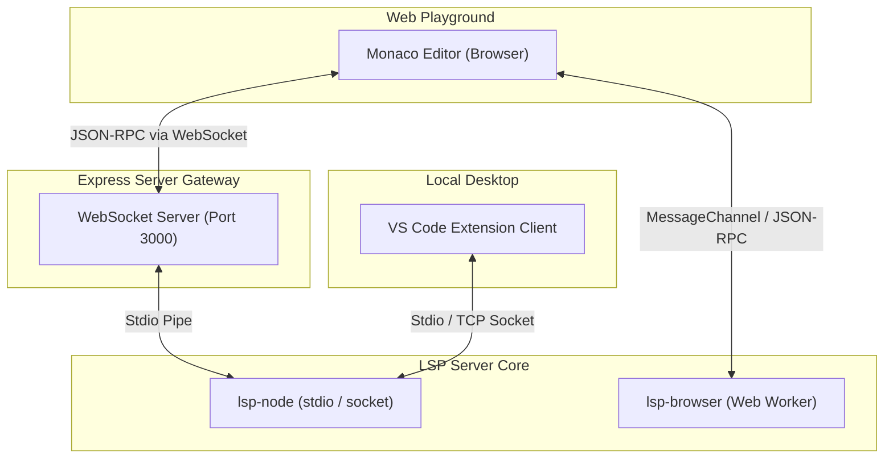

<div align="center">

# ⚡ LiquidJS Computational LSP

[](https://www.typescriptlang.org/)
[](https://nodejs.org/)
[](https://microsoft.github.io/language-server-protocol/)
[](https://pnpm.io/)
[](https://vitest.dev/)

A specialized **Language Server Protocol (LSP)** implementation for LiquidJS computational worksheets. It enforces static type safety, resolves composite variable schemas, registers smart auto-completions, formats source code, and fixes mistakes on-the-fly — designed for domain experts writing computation templates, not just developers.

</div>

---

## 🗺️ Architecture Overview



### Monorepo Structure

```
liquid-lsp/
├── packages/
│   ├── key-pointer-schema/   # Wire-format schema parser → LiquidType
│   ├── liquid-core/          # LiquidJS engine, tokenizer, Chevrotain parsers, metadata
│   ├── lsp-common/           # ALL LSP features — runtime-agnostic core
│   ├── lsp-node/             # Node.js stdio/socket transport
│   └── lsp-browser/          # Web Worker bundle + Monaco client
├── lsp-engine/               # Integration test harness
├── express-server/           # Monaco Editor playground at localhost:3000
└── vscode-extension/         # VS Code extension client
```

---

## 🚀 Feature Matrix

| Feature | Description | LSP Method | Quick Fix |
|:---|:---|:---|:---:|
| **Type Inference** | Infers types from `assign`, `parseAssign`, `for` loop variables | Diagnostics | ❌ |
| **Composite Property Validation** | Validates dot-path access on schema objects and `parseAssign` JSON | Diagnostics | ❌ |
| **Loop Variable Type Narrowing** | Propagates element type from composite collections to `for` loop variables | Diagnostics | ❌ |
| **Type Mismatch Linting** | Warns when string filters apply to numbers, and vice versa | Diagnostics | ❌ |
| **Nil / Optional Warnings** | Warns when optional schema fields are accessed without a fallback | Diagnostics | ✅ |
| **Unused Variable Warnings** | Flags variables that are assigned but never read or rendered | Diagnostics | ❌ |
| **Inline Math Converter** | Converts `x + 5` → `x \| plus: 5` automatically | `codeAction` | ✅ |
| **Single-Equals Fix** | Converts `=` → `==` inside conditionals | `codeAction` | ✅ |
| **Filter Spelling Correction** | Levenshtein nearest-match for mistyped filter names | `codeAction` | ✅ |
| **Quoted Filter Name Fix** | Removes quotes from `\| "upcase"` → `\| upcase` | `codeAction` | ✅ |
| **Unclosed Tag Fix** | Inserts matching `` for unclosed block tags | `codeAction` | ✅ |
| **Strict Formatter** | Indentation, quote normalization, delimiter spacing, tag splitting | `formatting` | ✅ |
| **Smart Autocomplete** | Variables, composite fields, filter names, tag names | `completion` | ❌ |
| **Rich Hover Cards** | Type info, field hierarchy, dropdown options on hover | `hover` | ❌ |
| **Filter Signature Help** | Parameter list + docs when typing filter arguments | `signatureHelp` | ❌ |
| **Document Outline** | Variable and block tree with precise selection ranges (Chevrotain-powered) | `documentSymbol` | ❌ |
| **Go-to-Definition** | Jump to variable declarations and `parseAssign` JSON keys | `definition` | ❌ |
| **Multiple Syntax Errors** | Token-by-token parser reports all errors concurrently | Diagnostics | ❌ |
| **Semantic Flow Highlighting** | Color-codes variables based on computational role (`source`, `intermediate`, `output`, `dead`) | `semanticTokens` | ❌ |
| **Rename Schema Guards** | Blocks renaming of backend schema variables and detects local shadowing | `rename` | ❌ |
| **Multi-Branch Type Consistency** | Asserts identical types for variables assigned across conditional branches | Diagnostics | ✅ |
| **Filter Parameter Type Check** | Validates filter argument types, date placeholders, and division-by-zero | Diagnostics | ❌ |
| **Schema-Aware Hover Docs** | Dynamically substitutes matching schema variables in hover card examples | `hover` | ❌ |


---

## 💎 Feature Deep-Dive

### 1. Type Inference — `assign`, `parseAssign`, `for`

The LSP statically infers types across all three variable declaration mechanisms:

```liquid
                            {# → number #}
                      {# → string #}


{# → composite: { title: string, cost: number } #}


  {{ row.title }}        {# ✅ row typed from item_list element composite #}
  {{ row.non_existent }} {# ⚠️ Property "non_existent" does not exist on row { title: string, cost: number } #}

```

### 2. Composite Property Validation

Validates every dot-notation property access against the schema or inferred composite type:

```liquid
{{ user.address.zipcode }}    {# ✅ resolved through composite nesting #}
{{ user.phone.fax }}          {# ⚠️ Property "fax" does not exist on "phone" { number: string, code: string } #}
```

### 3. Type Mismatch Linting

```liquid


```
> [!WARNING]
> **LSP Warning:** `Type mismatch: Math filter "plus" is applied to a string value.`

### 4. Redundant Redefinition Warnings

```liquid

    {# ⚠️ "score" was overwritten before its value was ever read #}
```

### 5. Inline Math Auto-Converter

```liquid

```
**Quick Fix →** ``

### 6. Single-Equals Comparison Fix

```liquid

```
> [!IMPORTANT]
> **LSP Warning:** `Assignments are not allowed inside conditional statements.`

**Quick Fix →** ``

### 7. Strict Document Formatter

```liquid
{# Before #}

{{name|upcase}}

{{price}}


{# After #}

  {{ name | upcase }}

  {{ price }}

```

Enforces: block indentation (2 spaces), quote normalization (`'` → `"`), delimiter spacing, and consecutive tag splitting.

### 8. Rich Hover Cards

Hovering over a schema variable shows its full type hierarchy:

```
user.address
─────────────────────────
composite {
  street:    string
  city_name: string
  pincode:   string
}
```

### 9. Filter Signature Help

Typing `{{ description | truncate: ` shows:
```
truncate(length: number, truncate_string: string = "...")
```

### 10. Spelling Auto-Correction

```liquid
{{ "hello" | upcasee }}
```
> [!TIP]
> **Quick Fix:** `Unknown filter "upcasee". Did you mean "upcase"?`

---

## 🔌 Connection & Deployment Modes

### 1. Local Stdio Mode (VS Code Default)

The VS Code extension spawns the LSP server automatically. No setup required.

### 2. Remote TCP Socket Mode

```bash
# On remote server:
node lsp-engine/dist/main.js --socket=6009
```

```json
// VS Code settings.json:
"liquid.server.mode": "remote",
"liquid.server.host": "your-remote-server-ip",
"liquid.server.port": 6009
```

### 3. Browser Web Worker Mode (Monaco)

The `lsp-browser` package bundles the full LSP into a Web Worker:

```html
<script type="module">
  import { connectBrowserLspWorker } from '/lsp-browser-client.js';
  const client = await connectBrowserLspWorker('/lsp-worker.js');
  await client.sendRequest('initialize', {
    capabilities: {},
    initializationOptions: { schema: { /* ... */ } },
  });
</script>
```

### 4. Express WebSocket Gateway (Monaco Playground)

```bash
pnpm run start:playground   # http://localhost:3000
```

The playground includes a Monaco Editor wired to the LSP with full diagnostics, hover, completions, formatting, and theme toggle.

---

## 🛠️ Developer Setup

### Prerequisites
- Node.js ≥ 20
- pnpm ≥ 10 (`npm install -g pnpm`)

### Install & Build

```bash
pnpm install
pnpm run build
```

### Commands

```bash
pnpm test                      # Run all tests
pnpm run start:playground      # Monaco playground at localhost:3000
pnpm run lint                  # ESLint
pnpm run format                # Prettier
pnpm run package:extension     # Build .vsix for VS Code
```

### Debug in VS Code

1. Open the repo root in VS Code.
2. Go to **Run and Debug** (`Ctrl+Shift+D`).
3. Select **`Debug Client & Server`** and press `F5`.
4. Set breakpoints in `vscode-extension/src/client.ts` or `packages/lsp-common/src/**`.

---

## 📝 Technical Details

- **Language**: TypeScript 6.x (ES Modules, strict no-`any`)
- **Package Manager**: pnpm workspaces
- **Parser**: Custom [Chevrotain](https://chevrotain.io/) tag argument parser for precise diagnostic ranges
- **LiquidJS**: Custom fork `github:sonuKumar03/liquidjs` with `computeColumn`, `assignVar`, `parseAssign` tags
- **LSP Protocol**: `vscode-languageserver` 3.17
- **Tests**: Vitest — unit + JSON-RPC integration tests

---

## 📚 Documentation

| Document | Description |
|---|---|
| [AGENTS.md](./AGENTS.md) | Monorepo architecture, coding conventions, AI agent guide |
| [developer_reference.md](./developer_reference.md) | API reference — how to add diagnostics, quick fixes, hover, completions |
| [repo-skills/enhancements/computation_lsp_features.md](./repo-skills/enhancements/computation_lsp_features.md) | Planned LSP feature roadmap (8 features) |
| [repo-skills/enhancements/lsp_refactoring_guide.md](./repo-skills/enhancements/lsp_refactoring_guide.md) | Planned refactoring operations (10 refactors) |
| [repo-skills/references/handover.md](./repo-skills/references/handover.md) | Full project handover document for new contributors |
| [packages/lsp-common/README.md](./packages/lsp-common/README.md) | Core LSP package reference |
| [packages/liquid-core/README.md](./packages/liquid-core/README.md) | Engine, tokenizer, parser reference |
| [packages/key-pointer-schema/README.md](./packages/key-pointer-schema/README.md) | Schema wire-format and type mapping reference |
