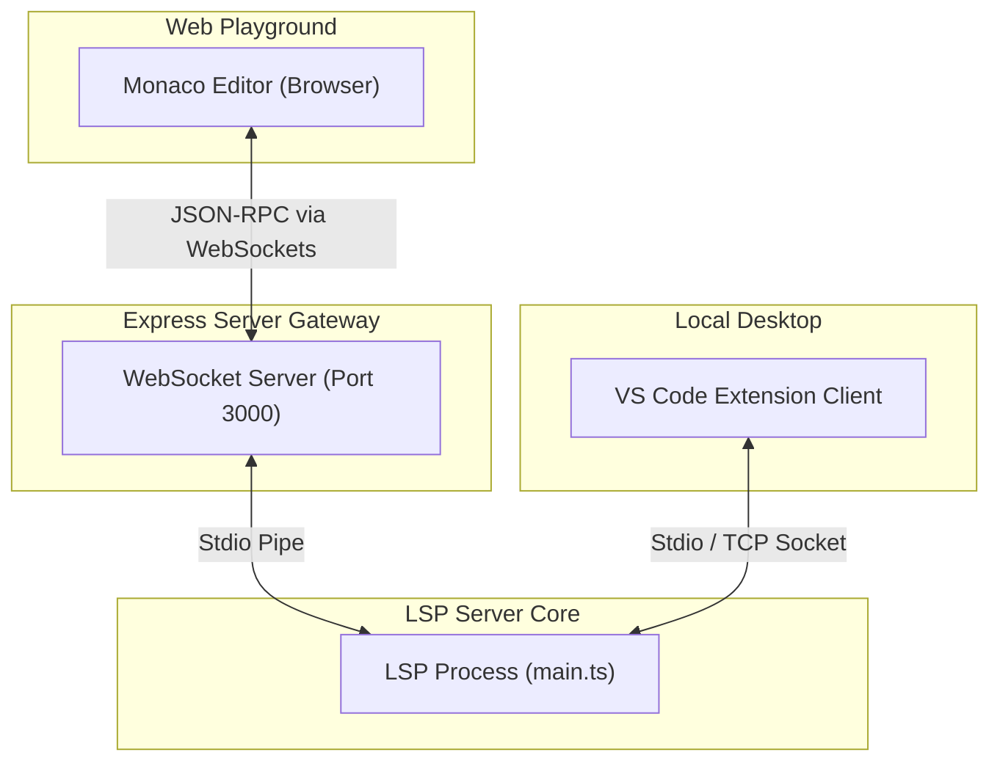

<div align="center">

# ⚡ LiquidJS Computational LSP

[](https://www.typescriptlang.org/)
[](https://nodejs.org/)
[](https://microsoft.github.io/language-server-protocol/)
[](https://vitest.dev/)

A specialized Language Server Protocol (LSP) implementation tailored specifically for templates and worksheets writing computational expressions. It enforces static type safety, resolves variable schema definitions, registers auto-completions, formats source code, and fixes mistakes on-the-fly.

</div>

---

## 🗺️ Architecture Overview

The following diagram illustrates how browser-based editors (via Monaco) and local instances (via VS Code) connect to the core LSP engine:



---

## 🚀 Key Feature Matrix

| Feature | Capabilities | LSP Command | Quick-Fix Support |
| :--- | :--- | :--- | :---: |
| **Type Validation** | Statically checks operations on numbers, dates, strings | Standard Lints | ❌ |
| **Inline Math Compiler** | Auto-converts math operations (`x + 5`) to math filters | `textDocument/codeAction` |  (Interactive) |
| **Single-Equals Fix** | Converts single assignments (`=`) in conditionals to comparisons (`==`) | `textDocument/codeAction` |  (Interactive) |
| **Strict Formatter** | Standardizes spacing, nested block indentation, and quote styles | `textDocument/formatting` |  (Auto-format) |
| **Hover Documentation** | Displays type structures, descriptions, and dropdown options on hover | `textDocument/hover` | ❌ |
| **Predefined Schemas** | Evaluates global composite and dropdown options schemas | Diagnostics | ❌ |
| **Outline Tree** | Generates outlines for statements, control tags, and variables | `textDocument/documentSymbol` | ❌ |
| **Spelling Suggestion** | Suggests closest matches for miswritten filters | `textDocument/codeAction` |  (Interactive) |

---

## 💎 Features Deep-Dive

### 1. Type Mismatch Linter Warnings
The LSP statically infers variable types (`string`, `number`, `boolean`, `unknown`) based on literal assignments and filter outputs. It automatically flags warning squiggles if mathematical filters are applied to non-numeric variables.
* **Example:**
  ```liquid
  
  
  ```
  > [!WARNING]
  > **LSP Warning on `plus`:** `Type mismatch: Math filter "plus" is applied to a string value.`

### 2. Redundant Redefinition Warnings
To prevent logic errors, the LSP warns developers if they overwrite (re-assign) a variable before its previous value was ever read in the template.
* **Example:**
  ```liquid
  
  
  ```
  > [!WARNING]
  > **LSP Warning on line 1:** `Variable "score" is overwritten here but its value was never read.`

### 3. Inline Math Auto-Converter (Quick-Fix)
Since Liquid does not natively support inline mathematical operators (`+`, `-`, `*`, `/`), the LSP detects inline math expressions, flags them, and offers an automatic Quick-Fix to translate them into standard Liquid math filters.
* **Example:**
  ```liquid
  
  ```
  * **Quick-Fix Action:** Converts the line to ``.

### 4. Single-Equals Comparison Warning & Quick-Fix
Flags conditional statements (`if`, `unless`, `elsif`, `when`) that incorrectly use single equals assignment operators (`=`) instead of comparison operators (`==`), providing an automatic Quick-Fix option to correct them.
* **Example:**
  ```liquid
  
  ```
  > [!IMPORTANT]
  > **LSP Warning:** `Assignments are not allowed inside conditional statements.`
  * **Quick-Fix Action:** Converts the line to ``.

### 5. Strict Document Formatter
Provides standard strict code formatting (`textDocument/formatting`) that automatically enforces:
* **Block Indentation**: Indents nested tags using two spaces per level depth, including aligning branching/middle elements (`else`, `elsif`, `when`) with their parent tag.
* **Quote Normalization**: Scans string literals inside tags/outputs and converts single quotes (`'`) to double quotes (`"`), keeping literals containing nested double quotes unmodified.
* **Border Spacing**: Standardizes border padding space inside tag and output delimiters.
* **Before:**
  ```liquid
  
  {{name|upcase}}
  
  {{price}}
  
  ```
* **After Formatting:**
  ```liquid
  
    {{ name | upcase }}
  
    {{ price }}
  
  ```

### 6. Visual Hover Previews for Schema Variables
Provides rich markdown tooltips (`textDocument/hover`) when hovering over variables defined in the predefined schema. Hover cards detail:
* Type hierarchy of nested fields on composite objects.
* Primitive base typings.
* List of valid options for dropdown variables to guide non-technical template editors.

### 7. Dot-Notation Bracket Access & Array Indexing
Resolves property paths and bracket indices dynamically on composite array variables (e.g. `user.items[0].title` or `users[i].name`) without triggering false-positive unrecognized key diagnostics.

### 8. Filter Signature Help
When typing arguments for Liquid filters, a signature tooltip displays the list of parameters, their types, defaults, and usage documentation.
* **Example:** Typing `{{ description | truncate: ` displays:
  ```typescript
  truncate(length: number, truncate_string: string = "...")
  ```
  *Documentation:* `Truncates a string down to the number of characters passed as the first parameter. An optional second parameter can be passed to append to the truncated string.`

### 9. Spelling Auto-Correction (Quick-Fix)
Uses Levenshtein edit distance to detect mistyped filter names and suggests the correct filter as a Quick-Fix.
* **Example:**
  ```liquid
  {{ "hello" | upcasee }}
  ```
  > [!TIP]
  > **LSP Warning & Quick-Fix:** `Unknown filter "upcasee". Did you mean "upcase"?` -> Suggests changing to `upcase`.

### 10. Multiple Syntax Error Diagnostics
Instead of failing on the first error, the LSP runs a token-by-token parser that isolates errors inside specific tags, reporting all syntax issues across the document concurrently.

---

## 🔌 Connection & Deployment Modes

The Liquid LSP supports three different configuration modes depending on your client workspace:

### 1. Local Stdio Mode (Default)
By default, the VS Code extension runs locally. It automatically compiles and spawns the local LSP server process in the background and communicates over `stdio`. No setup is required.

### 2. Remote TCP Socket Mode
If you host the LSP server on a remote server/VM, you can configure the VS Code client to connect directly over a TCP socket:
1. Start the LSP server in Socket mode on the remote VM:
   ```bash
   node lsp-engine/dist/main.js --socket=6009
   ```
2. Configure your VS Code settings:
   ```json
   "liquid.server.mode": "remote",
   "liquid.server.host": "your-remote-server-ip",
   "liquid.server.port": 6009
   ```

### 3. Express WebSocket Gateway (Monaco Editor / Browsers)
For browser-based editors (like Monaco Editor) that cannot launch local child processes or use raw TCP sockets, run the included `express-server` WebSocket gateway:
1. Start the gateway server:
   ```bash
   npm start --workspace=express-server
   ```
   This exposes a WebSocket LSP gateway endpoint at `ws://localhost:3000/lsp`.
2. Connect your Monaco Editor (or web client) to the WebSocket endpoint to receive real-time lints, diagnostics, completions, and hover documentation.
3. **Web Playground Testing**: The `express-server` includes a pre-packaged web interface to interactively test the LSP:
   * **Start server**: Run `npm start --workspace=express-server`.
   * **Open UI**: Navigate to `http://localhost:3000` in your browser.
   * **Features to test**:
     * **Diagnostics**: Look for red error squiggles on initial load (e.g. `status = "Active"` assignment warning).
     * **Formatting**: Click the **Format Template** button (or press `Alt+Shift+F`) to trigger strict template indentation, spacing, and quote normalization.
     * **Completions**: Type `user.` or trigger completions inside output delimiters to see variable auto-completes.
     * **Hovers**: Hover over schema variables (like `user.first_name`) to view type details.
     * **Themes**: Toggle the **Dark Mode** / **Light Mode** button in the header.
4. **Angular Integration**: For a step-by-step example of setting up Monaco Editor inside an Angular application and linking it to this WebSocket gateway, refer to the [Angular Integration Guide](./angular_integration.md).

---

## 🛠️ Developer & Debugging Setup

You can debug the VS Code client extension and the LSP server concurrently inside VS Code:

1. Open this repository root folder in VS Code.
2. Go to the **Run and Debug** view in the sidebar (`Ctrl+Shift+D` or `Cmd+Shift+D`).
3. Select **`Debug Client & Server`** from the dropdown menu and press `F5`.
4. This will:
   * Run the root build command to compile all files.
   * Open a new **[Extension Development Host]** window with the extension activated.
   * Spawn the LSP server in debug mode listening on inspect port `6009`.
   * Automatically attach VS Code's debugger to the LSP server process.
5. You can now set breakpoints in:
   * `vscode-extension/src/client.ts` (client extension code)
   * `lsp-engine/src/**/*.ts` (LSP server logic)

---

## 📝 Technical Details

* **Language**: TypeScript (ESModules, strictly typed)
* **Underlying Engines**: `liquidjs`, `vscode-languageserver`, `fastest-levenshtein`
* **Test Suite**: Fully verified integration test coverage running LSP JSON-RPC clients in child processes via Vitest.
