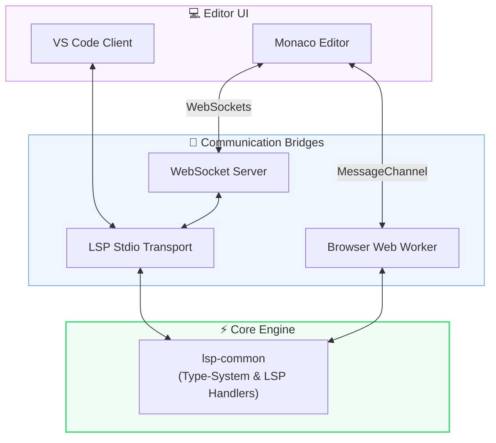

<div align="center">

# ⚡ LiquidJS Computational LSP

[](https://www.typescriptlang.org/)
[](https://nodejs.org/)
[](https://microsoft.github.io/language-server-protocol/)
[](https://pnpm.io/)
[](https://vitest.dev/)

A state-of-the-art **Language Server Protocol (LSP)** implementation designed for computational LiquidJS worksheets. It enforces static type safety, resolves nested schemas, offers smart auto-completions, formats syntax, and applies quick-fixes on-the-fly. Built to empower domain experts and developers writing complex calculation templates.

[✨ Live Playground](http://localhost:3000) • [📚 Developer Reference](./developer_reference.md) • [🏗️ Architecture Overview](./AGENTS.md)

</div>

---

## 🗺️ Architecture Overview

The monorepo separates the platform-agnostic core language intelligence from the environment runtimes (Node.js and Web Worker/Browser).



### Monorepo Structure

```
📁 liquid-lsp
├── 📁 packages
│   ├── 📄 key-pointer-schema   # Schema parser and type-mapping registry
│   ├── 📄 liquid-core          # Custom LiquidJS fork, tokenizer, Chevrotain tag parser
│   ├── 📄 lsp-common           # Platform-agnostic core LSP handlers & TypeSystem
│   ├── 📄 lsp-node             # Node.js stdio/socket server runtime
│   └── 📄 lsp-browser          # Web Worker compilation & Monaco client integration
├── 📁 vscode-extension         # VS Code client extension and configuration
├── 📁 express-server           # Express playground hosting Monaco Editor
├── 📁 angular-playground       # Angular-based Monaco playground client
└── 📁 lsp-engine               # Workspace integration testing suite
```

---

## 🚀 Feature Matrix

| Feature                                 | LSP Method / Diagnostic                                                    | Quick Fix |
| :-------------------------------------- | :------------------------------------------------------------------------- | :-------: |
| **🔍 Static Analysis & Diagnostics**    |                                                                            |           |
| **Type Inference**                      | Diagnostics (`assign`, `assignVar`, `parseAssign`, `computeColumn`, loops) |     —     |
| **Composite Property Validation**       | Diagnostics (dot-path schema matching)                                     |     —     |
| **Loop Variable Type Narrowing**        | Diagnostics (collection item typing)                                       |     —     |
| **Type Mismatch Linting**               | Diagnostics (filter constraints)                                           |     —     |
| **Nil / Optional Safety**               | Diagnostics (optional properties accessed without fallback)                | `✅ Yes`  |
| **Unused Variable Warnings**            | Diagnostics (dead-assign detection)                                        |     —     |
| **Multi-Branch Type Consistency**       | Diagnostics (assert types match across `if`/`else`)                        | `✅ Yes`  |
| **Filter Parameter Validation**         | Diagnostics (arg types, division-by-zero, placeholders)                    |     —     |
| **Engine & Tag Validations**            | Diagnostics (`computeColumn` rules, invalid JSON structures)               |     —     |
| **Syntax Errors Reporting**             | Diagnostics (token-by-token concurrent Chevrotain errors)                  |     —     |
| **⚡ Smart Code Actions & Quick Fixes** |                                                                            |           |
| **Inline Math Converter**               | `textDocument/codeAction` (`+` to `\| plus:`)                              | `✅ Yes`  |
| **Single-Equals Correction**            | `textDocument/codeAction` (`=` to `==` inside conditional)                 | `✅ Yes`  |
| **Filter Spelling Correction**          | `textDocument/codeAction` (Levenshtein match suggestions)                  | `✅ Yes`  |
| **Quoted Filter Name Fix**              | `textDocument/codeAction` (`\| "upcase"` to `\| upcase`)                   | `✅ Yes`  |
| **Unclosed Tag Auto-Insertion**         | `textDocument/codeAction` (appends end tags)                               | `✅ Yes`  |
| **💡 Editor Intelligence**              |                                                                            |           |
| **Smart Autocomplete**                  | `textDocument/completion` (variables, filters, tags, dot-paths)            |     —     |
| **Rich Hover Cards**                    | `textDocument/hover` (type hierarchy, docs, options)                       |     —     |
| **Schema-Aware Hover Docs**             | `textDocument/hover` (dynamic contextual examples)                         |     —     |
| **Filter Signature Help**               | `textDocument/signatureHelp` (parameter lists & documentation)             |     —     |
| **Go-to-Definition**                    | `textDocument/definition` (declaration locations, JSON keys)               |     —     |
| **Document Outline**                    | `textDocument/documentSymbol` (symbols hierarchy tree)                     |     —     |
| **Semantic Flow Highlighting**          | `textDocument/semanticTokens` (color-codes variable roles)                 |     —     |
| **Rename Schema Guards**                | `textDocument/rename` (API schema protection & local shadowing)            |     —     |

---

## 💎 Feature Deep-Dive

### 1. Type Inference — `assign`, `parseAssign`, `for`

Statically resolves types across standard assignments, custom JSON structures, and collections:

```liquid
                            {# → number #}
                      {# → string #}


{# → composite: { title: string, cost: number } #}


  {{ row.title }}        {# ✅ row typed from item_list element composite #}
  {{ row.non_existent }} {# ⚠️ Property "non_existent" does not exist on row { title: string, cost: number } #}

```

### 2. Composite Property Validation

Enforces schema compliance for deeply-nested dot-notation accesses:

```liquid
{{ user.address.zipcode }}    {# ✅ resolved through composite nesting #}
{{ user.phone.fax }}          {# ⚠️ Property "fax" does not exist on "phone" { number: string, code: string } #}
```

### 3. Type Mismatch Linting

Warns when filter requirements conflict with the incoming data type.

```liquid


```

> [!WARNING]
> **LSP Diagnostic:** `Type mismatch: Math filter "plus" is applied to a string value.`

### 4. Redundant Redefinition Warnings

Flags variables overwritten before they are read, saving computational and rendering cycles:

```liquid

    {# ⚠️ "score" was overwritten before its value was ever read #}
```

### 5. Inline Math Auto-Converter

Translates standard infix mathematical notation into Liquid's pipeline format.

```liquid

```

> [!TIP]
> **Quick Fix:** Convert to ``

### 6. Single-Equals Comparison Fix

Prevents accidental assignments inside conditionals.

```liquid

```

> [!IMPORTANT]
> **LSP Diagnostic:** `Assignments are not allowed inside conditional statements.`
>
> **Quick Fix:** Convert to ``

### 7. Strict Document Formatter

Normalizes whitespace, formatting tags, quote marks, and block indentation.

**Before:**

```liquid

{{name|upcase}}

{{price}}

```

**After (Formatted):**

```liquid

  {{ name | upcase }}

  {{ price }}

```

> [!NOTE]
> Enforces standard rules: 2-space indentation, quote normalization (`'` → `"`), uniform delimiter spacing, and consecutive tag splitting.

### 8. Rich Hover Cards

Reveals nested type documentation and field lists on hover:

```yaml
user.address
─────────────────────────
composite {
  street:    string
  city_name: string
  pincode:   string
}
```

### 9. Filter Signature Help

Shows signature helpers when typing filter parameters:

```
{{ description | truncate: [length: number, truncate_string: string = "..."] }}
```

### 10. Spelling Correction

Uses Levenshtein distance to offer quick fixes for mistyped filters:

```liquid
{{ "hello" | upcasee }}
```

> [!TIP]
> **Quick Fix:** `Unknown filter "upcasee". Did you mean "upcase"?`

---

## 🔌 Connection & Deployment Modes

The server can be deployed in four flexible topologies:

### 1. Local Stdio Mode (Default Desktop VS Code)

Spawns the Node.js language server binary directly as a subprocess of the editor client. No manual setup required.

### 2. Remote TCP Socket Mode

Runs the LSP server on a remote server for environments running thin clients.

```bash
# On remote host:
node lsp-engine/dist/main.js --socket=6009
```

Configure your client (e.g. VS Code `settings.json`):

```json
"liquid.server.mode": "remote",
"liquid.server.host": "your-remote-server-ip",
"liquid.server.port": 6009
```

### 3. Browser Web Worker Mode (Monaco Client-Side)

No backend server required. Runs completely client-side in the browser by compiling into a Web Worker:

```javascript
import { connectBrowserLspWorker } from '/lsp-browser-client.js';

const client = await connectBrowserLspWorker('/lsp-worker.js');
await client.sendRequest('initialize', {
  capabilities: {},
  initializationOptions: {
    schema: {
      /* client schema here */
    },
  },
});
```

### 4. Express WebSocket Gateway (Monaco Dev Playground)

Wires a remote Monaco Editor client to the LSP server over WebSockets:

```bash
pnpm run start:playground   # Starts playground at http://localhost:3000
```

Includes a live-reloading interactive code editor with real-time linting, formatting, hover tips, autocomplete, and theme toggling.

---

## 🛠️ Developer Setup

### Prerequisites

- **Node.js**: `v20.x` or higher
- **pnpm**: `v10.x` or higher (`npm install -g pnpm`)

### Installation & Build

Get the workspace up and running locally:

```bash
pnpm install
pnpm run build
```

### Commands Registry

Run commands from the repository root:

```bash
pnpm test                      # Run vitest suite across all packages
pnpm run start:playground      # Launch local Monaco Playground (http://localhost:3000)
pnpm run lint                  # Run ESLint validation
pnpm run format                # Re-format files with Prettier
pnpm run package:extension     # Compile & package VS Code extension (.vsix)
```

### Debugging in VS Code

1. Open the repository root directory in VS Code.
2. Open **Run and Debug** (`Ctrl+Shift+D` or `Cmd+Shift+D`).
3. Select **`Debug Client & Server`** and press `F5`.
4. Set breakpoints in `vscode-extension/src/client.ts` or `packages/lsp-common/src/**`.

---

## ⚙️ Tech Stack & Specifications

- **TypeScript 6.x**: High-performance, modern type-safety with a strict no-`any` policy.
- **ES Modules**: Standard Node ESM (`type: module`) using explicit `.js` import extensions.
- **pnpm Workspaces**: Clean monorepo dependency orchestration and local linking.
- **Chevrotain Parser**: High-performance custom parser for token-by-token analysis and precise error ranges.
- **LiquidJS Fork**: Uses `github:sonuKumar03/liquidjs` which contributes tag parsers like `computeColumn`, `assignVar`, and `parseAssign`.
- **LSP Protocol**: Fully compatible with LSP v3.17 (`vscode-languageserver`).
- **Testing**: Unified Vitest suite executing unit tests and full JSON-RPC integration test scenarios.

---

## 📚 Documentation Registry

To learn more about specific components and internals, explore these documents:

| Document                                                             | Purpose / Highlights                                                                           |
| :------------------------------------------------------------------- | :--------------------------------------------------------------------------------------------- |
| [AGENTS.md](./AGENTS.md)                                             | Monorepo architecture roadmap, coding style rules, and AI development guide.                   |
| [developer_reference.md](./developer_reference.md)                   | Step-by-step instructions for adding features (Diagnostics, Quick Fixes, Autocomplete, Hover). |
| [handover.md](./repo-skills/references/handover.md)                  | Handover blueprint containing design rationale, codebase state, and future roadmap.            |
| [key-pointer-schema README](./packages/key-pointer-schema/README.md) | Parser and mapper specifications for variable wire-format schemas.                             |
| [liquid-core README](./packages/liquid-core/README.md)               | Custom LiquidJS parser, Chevrotain grammar, tokenizer, and tags.                               |
| [lsp-common README](./packages/lsp-common/README.md)                 | Platform-agnostic LSP implementation handlers, state, and type system.                         |
