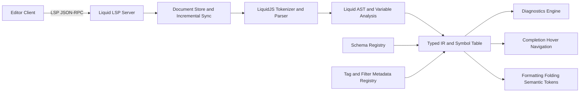
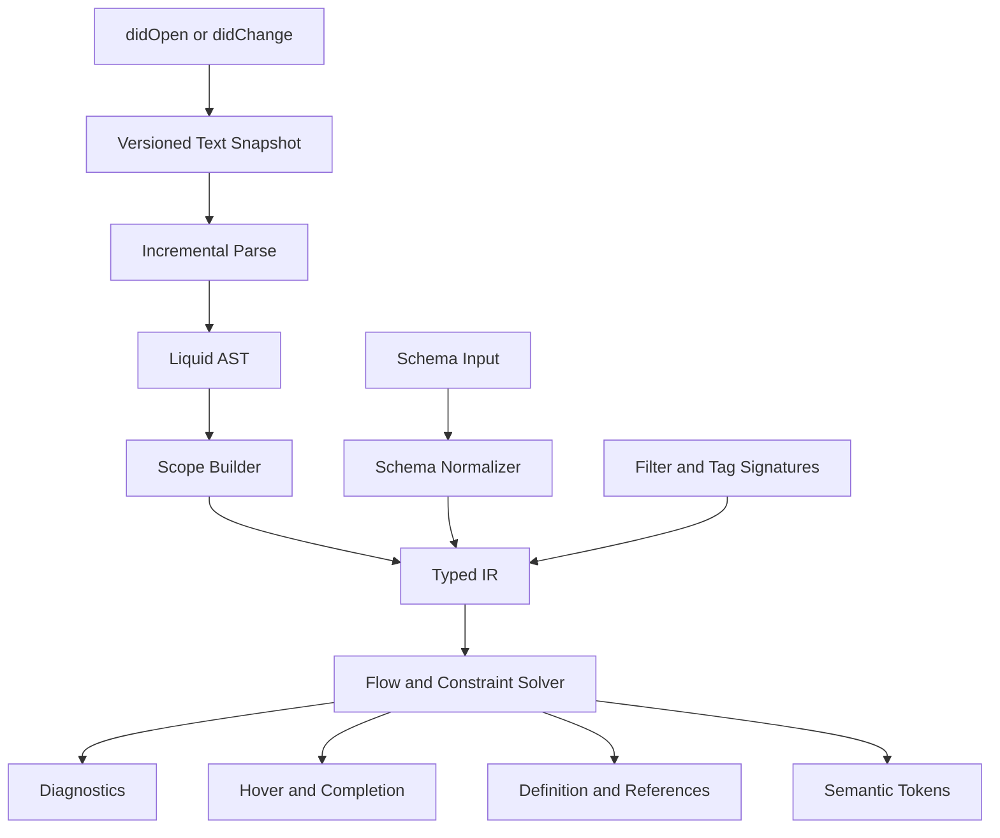

# Designing and Implementing an LSP for a Schema-Aware Computation-Only LiquidJS Engine

## Executive Summary

A strong design for this problem is a **standalone Language Server Protocol server implemented in TypeScript**, built directly on **LiquidJS internals** and the official Node LSP stack, rather than a TypeScript language-service plugin or a separate non-JS server bridged over IPC. That recommendation follows from three primary facts: LiquidJS is a pure JavaScript engine written in TypeScript and exposes parser, tokenizer, tag, filter, and static-analysis APIs; the official Node LSP implementation exists specifically to build language servers in Node/TypeScript; and TypeScript language-service plugins are explicitly limited to augmenting the editing experience and cannot add new syntax or change TypeScript’s core type-checking behavior. citeturn4view1turn23view0turn11view3

For schema input, the best default is to make **JSON Schema Draft 2020-12 the canonical external schema format**, while optionally accepting **TypeScript declaration files or type snippets** through an adapter layer and deferring a **custom DSL** until there is clear evidence that the standard formats cannot express the project’s needs. JSON Schema gives you standardized object, array, union-like combinators, validation semantics, `$defs`/`$ref`, and extensibility via annotation-like unknown keywords; TypeScript gives you ergonomic authoring, generics, object typing, and control-flow narrowing, but it is not a runtime validation standard. A practical system can normalize all accepted formats into one **internal type graph** used by the LSP. citeturn4view4turn11view0turn11view1turn24view2turn24view3turn24view4

The most important architectural decision is to treat LiquidJS as the **syntax and semantic substrate**, but not as the entire language-analysis engine. LiquidJS already tokenizes Liquid constructs, parses templates into template nodes, supports custom tags and filters, and provides static analysis over variables, globals, and locals. However, a high-quality LSP for a computation-only engine still needs an additional layer: a **typed intermediate representation**, a **scope and symbol model**, a **schema registry**, and **flow-sensitive inference rules** for `assign`, conditionals, loops, filter chains, and user-defined tag/filter signatures. citeturn10view4turn22search5turn20view0turn20view1turn10view2

Scope should be narrowed aggressively for a computation-only environment. LiquidJS supports many template-oriented constructs, but the language server should prioritize a computational subset: expressions in outputs, `assign`, conditional tags, iteration, `break`/`continue`, `case`, and a curated set of pure filters, especially math filters because LiquidJS does not support arithmetic operators directly in expressions. Features like `render`, `include`, layouts, and unrestricted filesystem/template loading should be disabled or heavily restricted by default because they complicate analysis and expand the security boundary. LiquidJS’s own documentation already distinguishes parsing, rendering, static analysis, and security controls such as `strictVariables`, `strictFilters`, `lenientIf`, `parseLimit`, `renderLimit`, and `memoryLimit`. citeturn1search3turn24view1turn10view1turn28view0turn28view1

The server should implement the user-requested LSP feature set fully, but not all features need equally deep semantics on day one. Diagnostics, completions, hover, semantic tokens, definition, references, signature help, and workspace symbols should be first-class from the start. Formatting, code actions, and folding can initially be mostly syntactic. The LSP 3.17 specification explicitly defines all of these request and notification shapes, supports incremental text synchronization, supports lazy completion resolution, and supports full or delta-based semantic tokens. citeturn5view0turn5view2turn5view3turn5view4turn5view5turn5view6turn5view7turn5view9turn26view0turn26view2turn27view2

A realistic delivery plan is a **twelve-week implementation** across four phases: parser and type-IR foundation, core editor intelligence, protocol breadth and performance, and adoption hardening. By the end of that period, you can reasonably ship a server that is usable in VS Code and portable to other editors, with schema-driven diagnostics and completions, flow-sensitive hover and go-to-definition, workspace-level indexing, and a small set of custom protocol extensions for schema synchronization and runtime profile awareness. That timeline is feasible because LiquidJS already provides much of the syntax pipeline and variable analysis surface, and because the Node LSP and TypeScript compiler ecosystems are mature. citeturn20view0turn20view1turn23view0turn4view6

## Goals and Scope

The server should be designed around a **computation-only Liquid dialect**, not a general-purpose storefront or HTML templating environment. That means the language model should treat Liquid documents primarily as **expression programs with variable binding, branching, looping, and filter application**, rather than as markup-first templates. LiquidJS syntax consists of tags and outputs, and operations such as comparison, logical operators, and `contains` are supported, but arithmetic operators like `+` are not; LiquidJS directs arithmetic through filters such as `plus`, `minus`, `times`, `divided_by`, `modulo`, and related math filters. citeturn9search5turn1search3turn24view1

That leads to a recommended support matrix:

| Area                                             | Recommendation                 | Rationale                                              |
| ------------------------------------------------ | ------------------------------ | ------------------------------------------------------ |
| Output expressions `{{ ... }}` / `echo`          | **Support fully**              | Core expression surface for computed values            |
| `assign`, `increment`, `decrement`               | **Support fully**              | Core state mutation and symbol definitions             |
| `if`, `elsif`, `else`, `unless`, `case`, `when`  | **Support fully**              | Required for control-flow-sensitive analysis           |
| `for`, `break`, `continue`                       | **Support fully**              | Required for array/object iteration and references     |
| Pure math/string/array filters                   | **Support fully**              | Computation depends on filters in LiquidJS             |
| `capture`                                        | **Optional**                   | Useful if string-building is part of the compute model |
| `raw`, `comment`, inline comments                | **Support syntactically**      | Important for parsing, folding, and formatting         |
| `render`, `include`, layouts, filesystem lookups | **Disable by default**         | Poor fit for calculation-only mode and security        |
| HTML semantics                                   | **Ignore semantically**        | Preserve lexically, but do not foreground in analysis  |
| Async Drops, arbitrary host objects              | **Support only with metadata** | Otherwise tool behavior becomes opaque                 |

This support model is consistent with LiquidJS’s operator set, filter categories, customizable tags/filters, and variable-strictness options, while keeping the language server analyzable and secure. citeturn1search3turn24view1turn10view2turn10view1

The scope contract should be explicit in configuration. The server should expose a `dialectMode: "computation"` setting that turns off file/template composition features and enables stricter semantics such as `strictVariables` and `strictFilters` in analysis mode. LiquidJS documents these options clearly: undefined filters can become parse exceptions with `strictFilters`, undefined variables can become render exceptions with `strictVariables`, and `lenientIf` relaxes strictness around optional variables in conditional contexts and before `default`. Those options map directly onto useful static-analysis behaviors. citeturn10view1

A subtle but important scoping rule is that the LSP should distinguish between **template-authored locals** and **application-provided globals**. LiquidJS already exposes static analysis results that separate `variables`, `globals`, and `locals`, and its `globalVariables`, `globalFullVariables`, and `globalVariableSegments` APIs are especially relevant for a schema-driven engine because they identify which values are expected to be provided by the host application rather than defined in the template. citeturn10view6turn20view0

For this engine, “done” should mean: authors can open a Liquid computation file, the server can identify all referenced host variables, validate them against a schema, understand custom filters and tags from a metadata registry, narrow types through control flow where possible, and produce actionable diagnostics and navigation even when the underlying runtime is only partially known statically. That is the correct balance between rigor and the inherent dynamism of LiquidJS. citeturn20view1turn24view3

## LSP Capability Design

The LSP feature set requested here maps cleanly to standard LSP 3.17 methods. Diagnostics are delivered via `textDocument/publishDiagnostics`; hover uses `textDocument/hover`; definition and references use `textDocument/definition` and `textDocument/references`; signature help uses `textDocument/signatureHelp`; formatting uses `textDocument/formatting`; workspace symbols use `workspace/symbol` and may be refined with `workspaceSymbol/resolve`; semantic tokens use `textDocument/semanticTokens` with full, range, or delta modes; folding uses `textDocument/foldingRange`; and code actions can be lazily completed via `codeAction/resolve`. The protocol also supports lazy completion enrichment through `completionItem/resolve`, which is especially useful when full filter/tag documentation is expensive to compute. citeturn5view0turn5view2turn5view3turn5view4turn5view5turn5view6turn5view7turn5view9turn26view0turn26view2turn26view3

The key design question is not whether to expose those capabilities, but **what each capability should mean in a computation-only Liquid setting**.

| Capability        | Minimum viable intelligence                                              | Mature intelligence                                                                                       |
| ----------------- | ------------------------------------------------------------------------ | --------------------------------------------------------------------------------------------------------- |
| Diagnostics       | Parse errors, unknown variables, unknown filters/tags, schema mismatches | Flow-sensitive type errors, dead branches, impossible filter chains, schema drift, unsafe dynamic access  |
| Completions       | Variables, properties, filters, tag names                                | Narrowed member completion, argument labels, ranked snippets, schema-aware literals                       |
| Hover             | Resolved type and documentation                                          | Narrowed type at point, provenance, runtime confidence level                                              |
| Go-to-definition  | `assign`, loop variables, schema properties, filter/tag declarations     | Cross-file schema definitions, registry sources, custom tag field definitions                             |
| References        | Variable definitions/usages in current document                          | Workspace-level references, schema property consumers                                                     |
| Signature help    | Filter/tag argument lists                                                | Overload selection, generic instantiation, docs and examples                                              |
| Formatting        | Stable whitespace and tag spacing                                        | Opinionated dialect formatting, range formatting, edit minimization                                       |
| Code actions      | Add missing `default`, fix misspelled filter/property                    | Generate schema stubs, introduce `assign`, wrap nullable access, convert dynamic lookup to checked branch |
| Workspace symbols | Template symbols and schema roots                                        | Filter/tag registry symbols, exported schema components                                                   |
| Semantic tokens   | Tags, filters, variables, properties, literals                           | Differentiate globals/locals/params, unknown members, control-flow keywords                               |
| Folding           | Block tags, comments, raw sections                                       | Region-like custom tags, collapsible computed chains                                                      |

The protocol also makes a strong case for **incremental synchronization**. LSP clients must support `didOpen`, `didChange`, and `didClose`, and `didChange` supports both full and incremental updates with explicit ordering guarantees. For a Liquid server, that should be used to maintain a versioned document store and incremental analysis graph rather than reparsing the entire workspace on each keystroke. citeturn27view2turn27view1

A clean capability declaration for `initialize` would look like this:

```json
{
  "capabilities": {
    "textDocumentSync": {
      "openClose": true,
      "change": 2
    },
    "hoverProvider": true,
    "definitionProvider": true,
    "referencesProvider": true,
    "documentFormattingProvider": true,
    "foldingRangeProvider": true,
    "workspaceSymbolProvider": {
      "resolveProvider": true
    },
    "completionProvider": {
      "resolveProvider": true,
      "triggerCharacters": [".", "|", ":", " "]
    },
    "signatureHelpProvider": {
      "triggerCharacters": ["|", ":", ","],
      "retriggerCharacters": [","]
    },
    "codeActionProvider": {
      "resolveProvider": true
    },
    "semanticTokensProvider": {
      "legend": {
        "tokenTypes": ["keyword", "function", "variable", "parameter", "property", "operator", "string", "number"],
        "tokenModifiers": ["definition", "readonly", "deprecated"]
      },
      "full": { "delta": true },
      "range": true
    }
  }
}
```

This shape is aligned with the 3.17 specification’s text-document sync, completion resolution, workspace-symbol resolution, and semantic-token full/delta support. citeturn27view1turn26view2turn26view3turn26view0

A representative diagnostics notification for a schema mismatch might look like this:

```json
{
  "method": "textDocument/publishDiagnostics",
  "params": {
    "uri": "file:///calc/example.liquid",
    "version": 17,
    "diagnostics": [
      {
        "range": {
          "start": { "line": 4, "character": 18 },
          "end": { "line": 4, "character": 31 }
        },
        "severity": 1,
        "source": "liquid-compute",
        "code": "type-mismatch",
        "message": "Filter 'plus' expects a number, but 'user.name' has type 'string'.",
        "data": {
          "inferredType": "string",
          "expectedType": "number",
          "filter": "plus"
        }
      }
    ]
  }
}
```

And a completion response at `user.` can be schema-aware and minimal up front, leaving documentation to `completionItem/resolve`:

```json
{
  "isIncomplete": false,
  "items": [
    {
      "label": "age",
      "kind": 10,
      "detail": "number",
      "insertText": "age",
      "data": { "kind": "property", "path": ["user", "age"] }
    },
    {
      "label": "email",
      "kind": 10,
      "detail": "string",
      "insertText": "email",
      "data": { "kind": "property", "path": ["user", "email"] }
    }
  ]
}
```

That lazy-loading pattern is directly encouraged by the spec for expensive completion details. citeturn26view2

For editors, diagnostics and hover will deliver the most immediate value, but semantic tokens are worth implementing early because LiquidJS exposes enough token structure to make them high-signal. The LSP semantic-token format is a five-integer encoding keyed by the legend’s `tokenTypes` and `tokenModifiers`, and the spec explicitly supports delta updates for efficient recoloring of changed files. That is a good fit for incremental editing in Liquid. citeturn26view1turn26view0

## Architecture and Integration with LiquidJS Internals

The recommended architecture is a **three-layer server**: a transport/protocol layer using the Node LSP libraries, a syntax/semantic extraction layer built on LiquidJS, and a type-analysis layer built on an internal schema-normalized type graph.



This design uses LiquidJS for the parts where it is already authoritative: tokenization, parsing, tag/filter registration, and built-in variable analysis. LiquidJS exposes a tokenizer that can read top-level tokens, output tokens, tag tokens, filters, ranges, property access, and expressions; a parser that can parse strings into template arrays, parse token streams, and convert top-level tokens into `Tag`, `Output`, or `HTML` nodes; and helper abstractions like `ParseStream` for event-style token processing. citeturn10view4turn22search5turn21view0turn22search1

LiquidJS internals are especially useful here because the tokenizer already recognizes most of the boundaries the LSP cares about. Its `readTopLevelTokens`, `readTagToken`, `readOutputToken`, `readExpression`, `readFilter`, `readValue`, `readRange`, and property-reading logic are exactly the syntax hooks needed for diagnostics, semantic tokens, and completion contexts. The tokenizer source also shows that property access, ranges, literals, numbers, operators, and filtered values are all distinct token kinds, which makes a high-quality semantic-token classifier feasible without writing a separate grammar. citeturn16view1turn22search1

The parser and template model fill in the next layer. LiquidJS’s parser exposes `parse`, `parseTokens`, `parseToken`, and `parseStream`, while `Tag` and `Output` nodes are concrete template implementations. Custom tags can be registered either as simple parse/render handlers or as tag classes, and tag parsing receives `remainTokens`, which is crucial for block tags and for any LSP-side logic that wants to understand region structure or local scopes introduced by custom constructs. citeturn22search5turn10view2turn16view0

LiquidJS’s built-in static analysis is not a complete LSP semantic engine, but it is an excellent seed. The library can statically analyze templates, identify variables, globals, and locals, record root segments and full variable paths, and attach variable locations with line/column/file metadata. In the source, the `StaticAnalysis` result explicitly separates variables that are out of scope—likely host-provided or mistaken—from locals introduced by tags like `assign`, `capture`, or `increment`. That distinction is exactly what a schema-aware LSP needs to map host schemas onto template references. citeturn13search3turn10view5turn10view6turn20view0turn20view1

The data-flow inside the server should look like this:



A concrete implementation should prefer a **standalone LSP server** over a TypeScript language-service plugin. The official TypeScript guidance is explicit: language-service plugins change the editing experience only; they cannot add new syntax or alter type-checking behavior, and they are not loaded by `tsc` for ordinary compilation. That makes plugins suitable only as optional interoperability layers—for example, if Liquid computations are embedded inside TypeScript strings—not as the main implementation vehicle for a custom Liquid language. citeturn11view3

TypeScript is therefore the best server language when the target is open-ended. LiquidJS itself is pure JavaScript and written in TypeScript strict mode, and the official Node LSP stack exists specifically to implement language servers in Node.js/TypeScript. Choosing TypeScript also means the schema adapter for `.d.ts` or TS type snippets can reuse the TypeScript compiler APIs without a protocol bridge. citeturn4view1turn23view0turn4view5turn4view6

A minimal registry wrapper might look like this:

```ts
import { Liquid, TagClass, FilterImplOptions } from 'liquidjs';

type LiquidType = { kind: 'number' } | { kind: 'string' } | { kind: 'boolean' } | { kind: 'array'; element: LiquidType } | { kind: 'object'; props: Record<string, LiquidType>; optional?: Set<string> } | { kind: 'union'; members: LiquidType[] } | { kind: 'unknown' };

interface FilterSignature {
  name: string;
  input: LiquidType;
  args: LiquidType[];
  returns: LiquidType;
  doc?: string;
}

interface TagSignature {
  name: string;
  params: LiquidType[];
  defines?: Record<string, LiquidType>;
  doc?: string;
}

class TypedLiquidRegistry {
  readonly engine = new Liquid({ strictVariables: true, strictFilters: true });
  readonly filters = new Map<string, FilterSignature>();
  readonly tags = new Map<string, TagSignature>();

  registerFilter(name: string, impl: FilterImplOptions, sig: FilterSignature) {
    this.engine.registerFilter(name, impl);
    this.filters.set(name, sig);
  }

  registerTag(name: string, tag: TagClass, sig: TagSignature) {
    this.engine.registerTag(name, tag);
    this.tags.set(name, sig);
  }
}
```

That pattern keeps runtime behavior in LiquidJS while giving the LSP a sidecar metadata layer for signatures, documentation, purity markers, and code actions.

## Schema-Driven Type System Design

The right overall design is to accept multiple schema input formats but normalize them all into one **internal type algebra**. That algebra should support primitives, literals, `null`, arrays, tuples, objects, maps, optionals, unions, intersections where useful, function signatures for filters/tags, and a few special meta-types such as `unknown`, `any`, and `never`. JSON Schema and TypeScript types give enough raw material to build that algebra; the LSP should not expose the internals directly, but all editor intelligence should be driven from it. citeturn4view4turn11view0turn11view1turn24view2turn24view4

The strongest schema-format comparison is this:

| Format                     | Strengths                                                                                                                                                       | Weaknesses                                                                                                                   | Recommendation                                  |
| -------------------------- | --------------------------------------------------------------------------------------------------------------------------------------------------------------- | ---------------------------------------------------------------------------------------------------------------------------- | ----------------------------------------------- |
| JSON Schema 2020-12        | Standardized validation; native object/array modeling; `anyOf`/`oneOf`/`allOf`; `$defs`/`$ref`; interoperable; extensible with annotation-like unknown keywords | Less ergonomic for authoring; function signatures and generics are not first-class                                           | **Canonical external format**                   |
| TypeScript types / `.d.ts` | Excellent editor ergonomics; object types, unions, generics, narrowing-friendly semantics                                                                       | Not a validation standard by itself; requires compiler-based adapter; semantics can exceed what Liquid runtime can guarantee | **Supported adapter format**                    |
| Custom DSL                 | Can match the domain exactly; can express filter/tag concepts directly                                                                                          | Reinvents tooling; documentation burden; migration risk                                                                      | **Only if standard formats prove insufficient** |

This comparison reflects JSON Schema’s role as a validation vocabulary and media type for describing JSON data, along with its standard objects, arrays, and combinators; and TypeScript’s object types, generics, and control-flow-aware type system. citeturn4view4turn11view2turn11view0turn11view1turn24view2turn24view3turn24view4

A good internal representation looks like this:

```ts
type TypeRef = { kind: 'unknown' } | { kind: 'never' } | { kind: 'null' | 'boolean' | 'number' | 'string' } | { kind: 'literal'; value: string | number | boolean | null } | { kind: 'array'; element: TypeRef } | { kind: 'tuple'; items: TypeRef[] } | { kind: 'object'; properties: Map<string, PropertySpec>; additional?: TypeRef | false } | { kind: 'union'; members: TypeRef[] } | { kind: 'intersection'; members: TypeRef[] } | { kind: 'map'; key: TypeRef; value: TypeRef } | { kind: 'callable'; params: ParamSpec[]; returns: TypeRef; generics?: GenericParam[] } | { kind: 'generic'; name: string; args?: TypeRef[] } | { kind: 'ref'; target: string };

interface PropertySpec {
  type: TypeRef;
  optional: boolean;
  readonly?: boolean;
  doc?: string;
}
```

That IR is expressive enough to represent JSON Schema objects and arrays, and it can also hold filter/tag signatures imported from TypeScript-style definitions.

For JSON Schema, the mappings are straightforward. Core object support comes from `properties`, where each property name maps to a subschema; arrays use `items`; and union-like constructs are naturally represented via `anyOf`, `oneOf`, and sometimes `allOf`. JSON Schema also permits unknown keywords to be treated as annotations, which is very useful here: the LSP can layer in vendor extensions such as `x-liquid-doc`, `x-liquid-filterInput`, `x-liquid-templateResult`, or `x-liquid-kind` without breaking standards-compliant validators. The core specification also notes that vocabularies may define extended type systems, which gives a specification-friendly path to domain-specific types such as `decimal`, `duration`, or `money` if your engine really needs them. citeturn11view1turn25search0turn11view0turn4view4

For TypeScript input, the adapter should parse `.d.ts` or type snippets into the same IR using the compiler API and type checker. The TypeScript compiler APIs expose `Program`, `TypeChecker`, symbols, types, and the language-service host model. The language service is designed for on-demand processing, and its host model tracks file versions and snapshots specifically to support responsive editor features and incremental parsing. That is ideal for schema ingestion and re-ingestion as type files change. citeturn4view5turn4view6

Generics are worth supporting, but selectively. TypeScript generics are valuable because they preserve type information without collapsing everything to `any`; they are especially useful for filter/tag signatures such as `first<T>(items: T[]) -> T | null` or `map<K extends keyof T, T>(items: T[], key: K) -> T[K][]`. However, generic support is much less important for template-authored variables than for **library-authored signatures** and reusable schema aliases. In practice, support generics in the registry and adapter layer, but avoid exposing template authors to generic syntax inside Liquid unless you have a compelling product need. citeturn24view2

A practical type-inference model for templates should include:

| Liquid construct          | Inference rule                                                                                                       |
| ------------------------- | -------------------------------------------------------------------------------------------------------------------- | ------------------------------------------------------------------ |
| `{{ a.b.c }}`             | property access over object/union/object-like types                                                                  |
| `{{ xs[0] }}`             | index into array/tuple, return element or union with nullish if out-of-bounds semantics are conservative             |
| ``   | bind `x` to inferred type of `expr`                                                                                  |
| `` | if `items: array<T>`, then `item: T`; if unknown, fall back to `unknown` with diagnostic                             |
| ``           | narrow inside branches if `cond` is a recognized type guard or truthiness discriminator                              |
| `{{ value                 | default: alt }}`                                                                                                     | if `value` is optional/nullish, return union simplified with `alt` |
| `{{ n                     | plus: m }}`                                                                                                          | require numeric-compatible arguments, return numeric type          |
| `{{ s                     | split: ',' }}`                                                                                                       | if `s` is string, return `array<string>`                           |
| `a[b.c].d`                | evaluate nested variable path conservatively; produce unresolved-member warnings if key type is not statically known |

LiquidJS’s own static-analysis examples explicitly include complex nested paths like `a[b.c].d`, and they also distinguish globals from locals created in loops or assignments. That means the LSP should be conservative around dynamic property access, but it should still record nested referenced variables for diagnostics and hover. citeturn9search6turn20view1

The most useful inference algorithm is a small flow-sensitive solver, inspired by TypeScript narrowing but tuned to Liquid semantics:

```ts
function inferExpr(expr: ExprNode, env: TypeEnv): TypeRef {
  switch (expr.kind) {
    case 'Literal':
      return literalType(expr.value);

    case 'Variable':
      return env.lookup(expr.path) ?? { kind: 'unknown' };

    case 'FilterChain': {
      let current = inferExpr(expr.base, env);
      for (const step of expr.filters) {
        const sig = env.registry.getFilter(step.name);
        if (!sig) return diagnosticUnknownFilter(step.name);
        const argTypes = step.args.map((a) => inferExpr(a, env));
        checkAssignable(current, sig.input, step.range);
        checkArgs(argTypes, sig.args, step.range);
        current = instantiateReturn(sig, [current, ...argTypes]);
      }
      return current;
    }

    case 'Contains':
      // boolean if lhs can contain rhs; otherwise emit diagnostic
      return { kind: 'boolean' };

    case 'PropertyAccess':
      return resolveProperty(inferExpr(expr.base, env), expr.segment, expr.range);

    default:
      return { kind: 'unknown' };
  }
}
```

For validation, the type system should support both **static checks** and **runtime conformance checks**. Static checks produce editor intelligence before execution. Runtime conformance checks verify that host-provided values and custom filter/tag implementations actually behave according to their declared schemas. This dual approach matters because LiquidJS is intentionally dynamic, and static analysis alone cannot fully model custom Drops, arbitrary host objects, or dynamic indexing. citeturn9search4turn28view2

A useful runtime architecture is:

- validate incoming host data against the canonical schema before rendering;
- validate filter/tag arguments at runtime in development and test modes;
- optionally validate filter/tag return values against declared signatures;
- emit machine-readable runtime observations that the LSP can ingest as low-priority “witness” data for future sessions.

This does **not** replace static analysis, but it closes the loop between declared and actual behavior in custom extensions.

## Static Analysis, Runtime Checks, and Implementation Plan

The implementation should combine **LiquidJS syntax processing**, **custom type analysis**, and **incremental editor-state management** rather than trying to push everything through one tool. LiquidJS can parse and analyze variables; the LSP layer should build typed scopes and constraint solving on top. TypeScript’s language-service design offers a useful model here: it emphasizes on-demand processing, distinguishes cheaper syntactic work from more expensive semantic work, and relies on file versions plus `ScriptSnapshot` objects to enable efficient incremental parsing. citeturn20view0turn20view1turn4view6turn4view5

A good implementation stack is:

| Concern                         | Recommended technology                                   |
| ------------------------------- | -------------------------------------------------------- |
| LSP transport and protocol      | `vscode-languageserver` and related Node packages        |
| Text document model             | `vscode-languageserver-textdocument` or equivalent       |
| Liquid parsing/render semantics | `liquidjs`                                               |
| Standard schema ingestion       | Draft 2020-12 JSON Schema validator and normalizer       |
| TypeScript schema ingestion     | TypeScript compiler API / language service               |
| Caching and indexing            | Versioned in-memory graph plus optional persistent cache |
| Editor packaging                | Thin VS Code client first, then generic LSP packaging    |

This stack is grounded in the official Node LSP implementation and the TypeScript compiler/language-service APIs. citeturn23view0turn4view5turn4view6

Performance should be treated as a core requirement from the outset. LiquidJS itself documents parsed-template caching and encourages parsing once and rendering many times, which is a strong hint for the LSP design: parse results and AST-like template nodes should be cached by document version and invalidated only on content changes. On the protocol side, incremental `didChange` sync should feed a document store keyed by URI and version. Completion docs and other expensive metadata should be deferred to resolve requests wherever possible, again following the LSP spec’s intended usage. citeturn24view0turn27view2turn26view2

The cache topology should include at least these structures:

```ts
interface DocumentState {
  uri: string;
  version: number;
  text: string;
  liquidAst?: TemplateNode[];
  syntaxDiagnostics?: Diagnostic[];
  staticVariables?: StaticVarIndex;
  symbolTable?: SymbolTable;
  typedIr?: TypedProgram;
  semanticTokens?: { resultId: string; data: number[] };
  schemaDeps: Set<string>;
}

interface WorkspaceState {
  docs: Map<string, DocumentState>;
  schemaStore: Map<string, NormalizedSchema>;
  registry: TypedLiquidRegistry;
  reverseSchemaDeps: Map<string, Set<string>>;
}
```

The key incremental rule is this: **cheap phases rerun eagerly, expensive phases rerun lazily**. Parsing, raw syntax diagnostics, and context-sensitive completions should happen on nearly every change. Whole-document type solving, workspace references, and semantic-token full recomputation should be deferred or memoized. This mirrors the “do the minimum necessary to answer the query” design principle documented by the TypeScript language service. citeturn4view6

A robust milestone plan looks like this:

| Milestone        | Scope                                                                                           | Exit criteria                                                   |
| ---------------- | ----------------------------------------------------------------------------------------------- | --------------------------------------------------------------- |
| Foundation       | LSP transport, document store, LiquidJS parse integration, registry metadata, canonical type IR | Open/change/save works; parse diagnostics and simple hover work |
| Core semantics   | Schema loaders, symbol table, `assign`/`if`/`for` inference, global-vs-local analysis           | Schema-driven diagnostics, completion, hover, definition        |
| Protocol breadth | References, signature help, semantic tokens, workspace symbols, folding, formatting             | Full requested capability matrix available in one editor        |
| Performance      | Incremental analysis, caches, completion resolve, semantic-token delta                          | Acceptable latency on medium workspace                          |
| Hardening        | Code actions, runtime witness hooks, test corpus, security restrictions, migration docs         | Release candidate ready                                         |

A twelve-week schedule is realistic:

| Time window             | Deliverable                                                   |
| ----------------------- | ------------------------------------------------------------- |
| Weeks one and two       | Document sync, parser bridge, token/span mapping              |
| Weeks three and four    | Type IR, schema normalization, filter/tag registry metadata   |
| Weeks five and six      | Diagnostics, hover, completions, definition, references       |
| Weeks seven and eight   | Signature help, semantic tokens, folding, formatting          |
| Weeks nine and ten      | Workspace symbols, code actions, runtime witness plumbing     |
| Weeks eleven and twelve | Performance tuning, fuzzing, adoption docs, release packaging |

For protocol extensions, keep them minimal and purposeful. Most configuration should flow through standard `workspace/configuration`, but a small number of custom methods are justified:

```json
{
  "method": "liquid/schema/update",
  "params": {
    "uri": "file:///schemas/customer.schema.json",
    "version": 3
  }
}
```

```json
{
  "method": "liquid/runtimeProfile",
  "params": {
    "document": "file:///calc/example.liquid",
    "observations": [
      {
        "path": ["user", "age"],
        "observedType": "number"
      }
    ]
  }
}
```

```json
{
  "method": "liquid/typeGraph",
  "params": {
    "textDocument": { "uri": "file:///calc/example.liquid" }
  }
}
```

The first tells the server that an external schema changed; the second optionally feeds runtime observations back into diagnostics; the third is mainly for debugging or editor plugins. None of these should be required for basic operation.

## Testing Strategy, Security, Migration, and Limitations

The test strategy should be layered. First come **parser and span tests**, ensuring every output, tag, filter, and property path maps back to correct LSP ranges. Then **type-inference golden tests** for `assign`, conditional narrowing, loops, filter chains, and union simplification. Then **protocol integration tests** that exercise actual LSP request/response sequences. Finally, **workspace-scale performance tests** and **fuzzing** for malformed templates and adversarial schemas. This layered approach is important because errors in range mapping, inference, and protocol plumbing tend to fail differently and should be isolated. The high test coverage reported for LiquidJS itself is encouraging, but it does not replace server-specific tests. citeturn22search6turn20view1

Representative test cases should look like this:

| Scenario                | Template                                                         | Expected behavior                                             |
| ----------------------- | ---------------------------------------------------------------- | ------------------------------------------------------------- | --------------------------------------------------------------------- | ----------- |
| Missing global          | `{{ customer.name }}` with no schema for `customer`              | diagnostic: unknown global root                               |
| Property typo           | `{{ customer.nmae }}`                                            | completion suggests `name`; diagnostic on typo                |
| Numeric filter mismatch | `{{ customer.name                                                | plus: 1 }}`                                                   | error: `plus` expects numeric input                                   |
| Conditional narrowing   | `{{ user.age                                    | plus: 1 }}`                                        | inside branch, `user.age` narrowed away from nullish if schema allows |
| Loop element inference  | `{{ item.price }}`      | `item` hover shows element object type                        |
| Dynamic access          | `{{ data[key] }}`                                                | hover returns conservative union/unknown; low-confidence note |
| Custom filter signature | `{{ amount                                                       | currency: "USD" }}`                                           | signature help shows params and return type                           |
| Schema update           | external schema changes `customer.age` from `string` to `number` | diagnostics and hover refresh without restarting server       |
| Semantic token delta    | edit one filter name in a long file                              | delta tokens returned, not full recompute                     |
| Code action             | `{{ maybeCount                                                   | plus: 1 }}`where`maybeCount` is optional                      | quick fix suggests `                                                  | default: 0` |

Security needs to be treated as both a runtime-engine issue and a language-server issue. LiquidJS’s own security model is explicit: `parseLimit`, `renderLimit`, and `memoryLimit` are DoS-oriented protections, but they are **cooperative safeguards, not strict runtime isolation**; they do not sandbox JavaScript execution and should be combined with process or container limits and timeouts. The docs also recommend avoiding fully user-defined templates when possible and prefer a restricted subset for online services. That advice aligns perfectly with this LSP design: disable `render`, `include`, layouts, and unrestricted filesystem behavior by default; isolate runtime validation in workers if executed; and require explicit configuration for custom Drops and host object exposure. citeturn28view0turn28view1turn28view2turn28view4

The server should therefore enforce these policies:

- **No filesystem-dependent template inclusion by default.**
- **Explicit filter/tag metadata required** for advanced semantics.
- **Schema validation on host inputs** before runtime analysis.
- **Explicit property-access mode** using `ownPropertyOnly`-style behavior for untrusted objects.
- **Render-isolation mode** for runtime witness gathering.
- **Hard caps** on file size, schema size, included file count, union expansion count, and analysis depth.

Migration should be incremental rather than all-at-once. A good adoption path is:

| Phase           | What users get                                                  | What they must provide                             |
| --------------- | --------------------------------------------------------------- | -------------------------------------------------- |
| Start           | Parse diagnostics, syntax coloring, basic completions           | Nothing                                            |
| Schema-aware    | Unknown-variable diagnostics, property completions, hover types | JSON Schema or TS type files for globals           |
| Extension-aware | Filter/tag signature help, custom diagnostics                   | Metadata registry for custom filters/tags          |
| Hardened        | Runtime conformance checks, code actions, workspace indexing    | Optional runtime instrumentation and policy config |

That rollout pattern reduces resistance: teams can adopt editor value first and bring schemas later, rather than requiring a full typing program before the LSP is useful.

The main limitations are structural, not accidental. Liquid permits dynamic property access and dynamic behavior through filters, tags, Drops, truthiness rules, and host objects. LiquidJS static analysis also documents that dynamic include names may be ignored, and partial analysis can be switched off deliberately. Those are reminders that no static analyzer can be fully precise in all cases. The server should therefore model **confidence**, not just type: a hover may say “`number | unknown` (low confidence due to dynamic key access)”, and diagnostics should distinguish hard errors from conservative warnings. citeturn9search6turn20view1turn10view1

The most important edge cases to plan for are these:

- dynamic property access such as `a[b.c].d`;
- unions that blow up through repeated branch/filter combinations;
- custom filters whose signatures are undocumented or whose return types depend on opaque host logic;
- Drops and prototype-backed objects that evade simple object-shape assumptions;
- discrepancies between static nullability and runtime `default`/truthiness behavior;
- multi-file template indirection if `render`/`include` are later enabled;
- schema references and remote schemas that change independently of the open document.

Those are not reasons to avoid the project. They are reasons to make the server explicit about what it knows, what it inferred, and what it cannot prove.

In summary, the technically rigorous design is: **a standalone TypeScript LSP on top of LiquidJS, with a normalized schema/type graph, a metadata registry for custom filters and tags, flow-sensitive but conservative static analysis, selective runtime validation hooks, and a restricted computation-oriented Liquid dialect by default**. That design is closely aligned with the underlying primary sources and gives the best path to a maintainable, high-signal language server. citeturn4view1turn20view0turn20view1turn23view0turn4view4turn4view6
